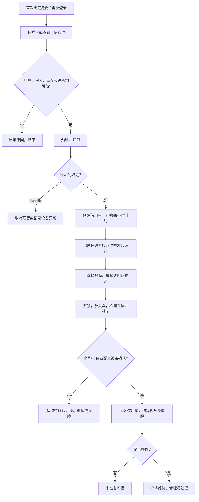

# 校园爱心伞：第一阶段规则与验收基线

版本：V1.0（2026-09-27）

范围：上海市格致中学校园公益爱心伞实验

状态：规则设计完成；本文件中的功能验收结果尚未执行

## 1. 目标和边界

本项目验证师生能否通过身份绑定、编号伞柜、适度积分和归还提醒，自助完成免费借还，并为课题积累可信的借还数据。正常借还不依赖门卫或管理员；管理员只处理维修、补货、设备故障和特殊情况。第一版从一个地点、一个实体仓位验证，再扩展多个仓位。软件阶段可使用设备模拟器，但模拟结果必须与实物结果分别标记。

学校名称、伞的编号、仓位编号和二维码应出现在伞身及柜体标识上。正式校徽只使用学校提供或确认的素材；目前仓库中的伞形图标是项目图标。

## 2. 角色、对象和身份

| 对象 | 第一版规则 |
| --- | --- |
| 学生 | 登记姓名、学号、班级；首次用学校确认的名单及一次性绑定凭据核验，再与微信身份绑定。 |
| 教师 | 登记姓名、工号、手机号码；首次同样核验并绑定微信身份。手机号码不展示给普通用户。 |
| 管理员 | 查看借还与逾期、处理维修、补货和异常；操作留下时间、操作者、理由。 |
| 雨伞 | 每把有唯一、永久编号和对应仓位；状态为可借、借出、待维修、遗失或停用。 |
| 仓位 | 每个实体仓位有唯一编号和二维码；记录空/有物、锁闭状态及设备事件。 |
| 借用单 | 关联一个用户、一把伞、一个归还仓位、借出时间、应还时间和归还时间。 |

微信登录只能识别微信账号，不能单独证明其学号、工号或姓名。仅填写个人资料或学号后四位也不能作为正式身份核验。未核验或未登录者可以查看项目说明，但不能借伞、还伞或读取他人的记录。试运行前必须确定学校允许使用的核验名单及凭据发放办法；暂缺时只能使用虚构演示身份。

## 3. 借还规则

1. 每人同时最多借一把；仅可借状态为“可借”、仓位检测正常的雨伞。借期从实体取走得到确认的时间算起，默认 **48 小时**。同一借用单的应还时间在创建后固定，之后修改全局参数不追溯更改旧单。
2. 借用请求先核验身份、积分、是否已有借用单、雨伞及设备状态，再预留仓位并发出开锁指令。开锁成功、检测到雨伞被取走后才正式记为“借出”。开锁失败或在暂定 **60 秒**内没有取走时，取消预留，保持库存可借；超时或传感器冲突进入异常待核对，不能自动生成成功借用。
3. 伞身二维码展示所属学校、伞号、状态和应归还的仓位。柜体或仓位二维码展示地点、柜号、仓位号和该仓位对应的伞号。二维码只提供定位信息，实际借还仍由服务器核验登录身份和借用单。
4. 归还者扫描或选择自己借用单对应的仓位，系统核对伞号、仓位号后解锁。用户放入雨伞，仓位检测到有物、状态连续稳定暂定 **3 秒**、仓门锁闭，并由服务器确认后，借用单才进入“已归还”。设备未完成上述检查时保持“借用中/归还待确认”，提示重试或报障。
5. 归还成功后显示回执和归还时间。完好的伞转为“可借”；已报修的伞转为“待维修”。归还成功才取消该笔借用尚未执行的提醒。重复扫码、重复点击或设备事件重发不能产生第二次借出、归还或积分变化。
6. 传感器只能确认仓位有物，不能独立证明放入的是指定雨伞。第一版通过固定编号、扫码核对、在位检测和锁闭联合验证；实物错放或替换仍需在维修、盘点中核查，课题报告应如实说明此限制。

### 借还流程

## 4. 单一积分规则

| 项目 | 第一版数值及判定 |
| --- | --- |
| 初始与上限 | 初始 100 分，最高 120 分，最低 0 分。 |
| 按时归还 | 归还确认时间不晚于应还时间，+2 分，每笔借用只加一次。 |
| 逾期 | 应还时间之后每满 24 小时，-10 分；不足 24 小时不扣分，也没有按时奖励。 |
| 借用限制 | 分数低于 60 时暂停新借用；有未归还借用单时也不能再借。 |
| 恢复 | 所有借用单关闭后，如分数仍低于 60，恢复到 70；分数已有 60 或以上则不变。 |
| 损坏 | 如实上报、拍照和归还不产生自动扣分；不设置押金、收费或兑换。 |

以借出时刻为 `T`，应还时刻为 `T+48h`。`T+48h` 确认归还算按时；`T+72h` 确认归还算逾期满 1 天，扣 10 分；`T+96h` 为满 2 天，累计扣 20 分。分数为 100 的用户逾期满 5 天时变为 50，归还后恢复至 70。积分流水记录借用单、原因、变化值、变化前后余额及时间；同一借用单的同一逾期日只能扣一次。

逾期天数以**可信的实体归还确认时间**计算。设备延迟上传或服务重启后补处理，不能把上传/重启时间冒充用户实际归还时间；需要使用有序、可核验的设备事件和服务器记录。若设备故障导致时间无法确认，先冻结该笔借用的进一步自动扣分，交由管理员按记录处理。

由于每人同时只能借一把，且低分用户在归还后恢复到 70 分，“低于 60 分暂停借用”在正常流程里很少单独发挥作用。第一版保留它作为规则反馈，不将其单独宣称为提升归还率的原因；不再加入兑换、等级、连续归还奖励或动态阈值。

## 5. 提醒与报修

提醒节点以实体借出时间 `T` 计算：`T+24h` 温馨提醒，`T+72h`（逾期满 1 天）提醒，`T+120h`（逾期满 3 天）再次提醒。每个节点每笔借用最多生成一次。积分按逾期满 24 小时的日界点计算，因此 `T+96h` 仍会扣第 2 天的 10 分，但不新增外发提醒。到达节点时若已归还，则不发送。记录“计划、无需发送、等待授权、接口接受、失败”等实际结果；微信未授权时不得显示为“已送达”或“已阅读”。站内记录可以用于演示，微信消息需要实际账号和授权验证。

用户在借用中或归还时均可报修，填写损坏位置及说明，照片可选。报修记录与雨伞和借用单关联；报修不等于实体归还，借用单仍保持未归还。归还成功后雨伞进入“待维修”，管理员可查看说明和照片并登记修复或报废。普通用户只能查看本人报修；管理员按职责查看。发生损坏但无法正常入仓时，显示报障入口，管理员核对实物和时间后关闭异常，不把“提交报修”直接当作归还。遗失也由管理员记录并关闭借用义务，停止无限期自动扣分；不凭系统猜测认定责任。

## 6. 页面与标识清单

| 页面或标识 | 必须提供的信息与操作 |
| --- | --- |
| 借还首页 | 学校名称、项目说明、可借伞和位置、扫码入口、本人正在借用的伞及到期时间。 |
| 首次身份绑定 | 学生姓名/学号/班级或教师姓名/工号/手机号；完成校内核验并绑定微信身份。 |
| 伞详情与伞身标识 | “上海市格致中学爱心伞”、伞号、对应仓位、二维码、当前是否可借。 |
| 柜体/仓位详情与标识 | 学校与柜体归属、地点、仓位号、对应伞号、二维码、是否正常。 |
| 借伞与归还 | 开锁和取走/放入的实时状态、操作说明、失败原因、成功回执。 |
| 报修界面 | “这把伞已经坏了，需要报修”、损坏说明、拍照或选择照片、提交结果。 |
| 我的记录 | 借还单、到期和归还时间、积分流水、提醒、本人报修。 |
| 管理页面 | 库存、逾期、设备异常、维修与补货、操作日志、课题数据导出。 |

小程序页面需显示学校归属标识。正式校徽素材及使用方式以学校确认为准；当前演示项目图标不能冒充正式校徽。第一版可将多个操作组织在少量页面中，无需为表中每行都创建独立页面。

## 7. 第一阶段规则推演与后续验收清单

下列是**纸面规则推演结果**，不是现有程序或实物的测试通过记录。第二阶段起逐项转成自动化或真机验收。

| 编号 | 输入或情形 | 应得到的结果 | 验证阶段 |
| --- | --- | --- | --- |
| R01 | 已核验用户借可用伞并实际取走 | 借用单成立，借出时间为取走确认时间，应还时间加 48 小时 | 软件/设备 |
| R02 | 开锁失败、未取走或重复请求 | 不产生已借出单；重复请求不重复开锁或占用库存 | 软件/设备 |
| R03 | 两名用户同时请求同一伞 | 最多一人成功 | 软件 |
| R04 | 同一用户已有未归还借用单 | 第二笔借用被拒绝 | 软件 |
| R05 | 恰好在到期时确认归还，原分 100 | 算按时，变为 102 | 软件 |
| R06 | 到期后 23 小时 59 分钟归还，原分 100 | 无奖励，无扣分，仍为 100 | 软件 |
| R07 | 逾期满 1/2/3 天，原分 100 | 在各日界点分别变为 90/80/70 | 软件 |
| R08 | 逾期满 5 天，原分 100，随后归还 | 先降至 50，关单后恢复 70；不重复扣分 | 软件 |
| R09 | 原分 119，按时归还 | 最多升至 120 | 软件 |
| R10 | 错误仓位、未检测到伞或仓门未锁闭 | 不确认归还，不加分，不恢复库存 | 软件/设备 |
| R11 | 同一次归还重复提交或设备事件重发 | 只关闭一次借用单、只结算一次积分 | 软件/设备 |
| R12 | 借用期间报修后尚未入仓 | 保持未归还；不扣损坏分；本人可查看报修 | 软件 |
| R13 | 报修伞入仓并确认归还 | 关闭借用单，伞待维修，禁止再次借出 | 软件/设备 |
| R14 | 已归还或没有微信订阅授权 | 未到期提醒取消；无授权记录为未发送，不能写成送达 | 软件/微信 |
| R15 | 服务重启或设备离线后补传事件 | 记录不丢失；按可信实体时间结算，不重复提醒和扣分 | 软件/设备 |
| R16 | 设备故障使归还时间不可信 | 暂停进一步自动扣分，进入管理员异常处理 | 软件/设备 |
| R17 | 普通用户尝试查看别人资料或照片 | 拒绝访问；管理员维修查看留痕 | 软件 |
| R18 | 管理员修好待修伞或确认遗失 | 状态、原因和时间可追溯；遗失借用不无限期扣分 | 软件/设备 |

## 8. 课题数据的最小口径

从第一笔正式试运行借用起，借用单记录借出、应还、归还、伞号和仓位号；设备事件、提醒尝试、积分流水与报修记录能够关联到对应借用单。以统一统计截止时刻计算：借用次数为已实际取走的借用单数；按时归还率的分母是应还时间已到的借用单数，分子是其中在应还时间前确认归还的单数；总体归还率的分子是其中在统计截止时已确认归还的单数。尚未到期的借用单单独列出，不提前算作未归还。平均借用时长只对已归还借用单计算，同时报告仍在借用的数量。损坏、维修和遗失分别统计；微信提醒只按实际可观察的发送结果统计，不将接口接受当作用户已读。

测试和模拟数据与试运行数据分开保存。问卷采用匿名汇总，不把个人回答强行关联到具体借伞记录。课题报告可以比较不同阶段数据，但不能仅凭同时上线的身份、积分、提醒三项措施断定某一项单独造成归还率变化。

## 9. 与当前演示代码的差异及进入下一阶段条件

截至本文件编写时，仓库 `server.js`/`README.md` 是旧演示规则：借期 168 小时、按时 +5 分、分级固定扣分、归还后恢复到 60 分，且借用在模拟开锁时即成功、归还靠用户勾选模拟在位检测；`data/state.json` 是 JSON 存储，身份与提醒也为演示模式。上述实现不能视为本基线已交付。第二阶段先改核心状态、规则与持久化，再用模拟器校验；后续再接微信和实物。

第一阶段结束条件：本文件包含范围、数值规则、借还与报修流程、页面/标识清单、异常边界、可复现的验收案例，并明确现有代码差异。正式试运行另外需要学校允许扫码使用手机、提供身份核验方式和正式标识素材，以及可用的小程序账号及设备条件；这些不是第一阶段规则文档的完成条件。
